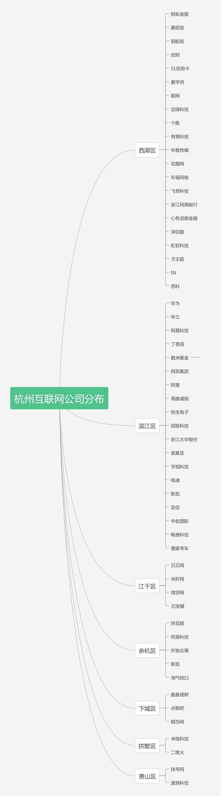

https://zhuanlan.zhihu.com/p/43928218

https://zhuanlan.zhihu.com/p/48448341

https://zhuanlan.zhihu.com/p/269727075





- 
- 
- 阿里巴巴
- 网易
- 海康威视
- 大华股份
- 有赞

- 美丽联合

- 九言科技

- 贝贝集团

- 开始吧

- 婚礼纪

- 电魂

- 酷家乐

- 微店

  - https://hr.weidian.com//social.html

  ```html
  工作内容：
      1.负责玩家社区H5产品的架构设计与开发；
      2.参与基础框架研发、工程化建设、组件生态建设、搭建、数据可视化等建设；
      3.参与新技术的调研与推广。
  职位要求：
      1.2年以上前端开发经验；
      2.掌握html、css、es6/7、TS，了解vue/react框架及其原理，对编写高质量组件有一定的理解；
      3.了解前端工程化，了解webpack、rollup、babel、postcss等工具及其原理；
      4.了解nodejs/java等服务端相关领域知识，了解koa/express框架及其原理；
      5.对数据结构、算法、网络、浏览器等有一定的理解；
      6.具备良好的自主学习、沟通能力及团队协作精神，对工作积极严谨，勇于承担压力。
  
  =================================================================================
  工作内容：
      1、负责设计和开发微店IM即时通讯H5/小程序/桌面版客户端，完成产品需求和技术迭代计划的工作内	   容；
      2、支持客服/电销等后台系统的前端开发工作。
  职位要求：
      1、计算机以相关专业，3年以上前端开发经验；
      2、精通 JavaScript、CSS、HTML 等前端相关技术，熟悉 W3C 标准与 ES 规范；
      3、熟练掌握至少一种前端框架( React/Vue/Angular 等)，并有一定的前端框架设计能力;
      4、有大型门户网站、商城、论坛、社区制作经验；
      5、了解各种构建工具，对前端性能优化有一定了解；
      6、 对svn,git等版本管理工具,linux操作系统比较熟悉，有开源项目的可以加分。
      7、 有electron等相关开发经验优先
      8、 性格开朗，积极向上，乐观豁达，正能量。
  
  =================================================================================
  工作内容：
      1、负责电商业务H5、小程序、Web、Node等前端开发工作；
      2、参与前端组件库、多端异构、脚手架等基础设施建设；
      3、参与前端页面性能优化、体验优化、稳定性建设；
      4、参与新技术探索、推进系统架构的演化。
  
  任职要求：
      1、计算机基础扎实，熟练掌握ES/TS、CSS、HTTP协议以及浏览器原理;
      2、理解组件化开发思想，有一定的设计能力，熟悉MV*框架、熟练掌握Vue、Vuex等框架;
      3、对前端构建和持续集成有一定的认识，熟练运用Gulp、Webpack；
      4、注重产品质量，具有良好的代码风格、接口设计能力；
      5、优秀的团队合作能力，优秀的分析和解决问题的能力以及良好的担当精神；
      6、熟悉NodeJs、有大型电商项目经验者加分；
  ```


- 恩牛网络

- 同花顺

  ```html
  岗位职责
      1、参与同花顺互联网金融产品的前端开发工作；
      2、支持H5产品在PC/浏览器/APP/公众号等各个平台上运行的方案设计和研发；
      3、探索和使用跨端技术，支持公司产品跨端（android、ios、桌面、小程序）运行；
      4、支持前端框架、组件和框架的方案制定、核心代码编写及推广；
      5、积极与产品需求方及协作方进行充分的沟通，推进项目进程。
  
  岗位要求
      1、大学本科计算机或相关专业，1年以上工作经验；
      2、熟练掌握前端开发技术(HTML5、JS、Ajax、Json、XHTML、CSS)，了解各项技术的相关标准，并	   严格按照标准进行开发；
      3、对模块化、组件化、OOP、MVC有较多实践并有自己的理解；
      4、思路清晰，具备良好的沟通能力和学习能力，且具备强烈的进取心、团队合作精神;
      5、对vue、react、flutter等框架熟练者优先；
      6、有团队管理经验者优先。
  ```


