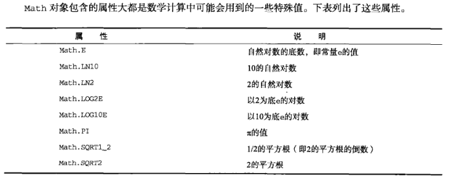
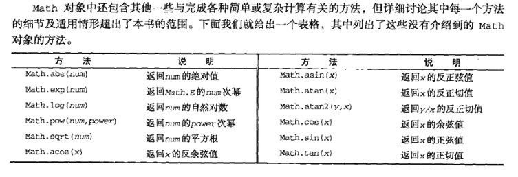
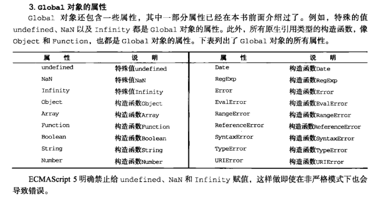
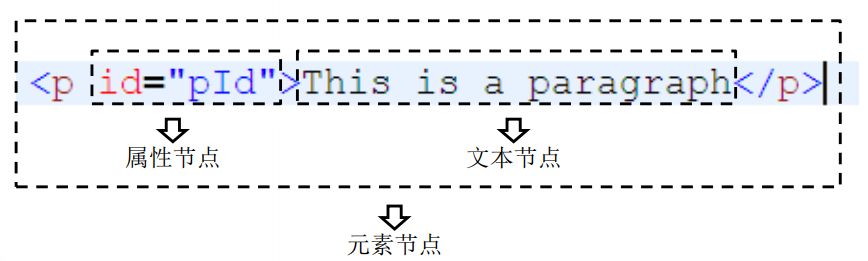
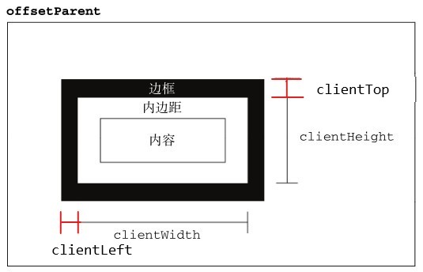

# JavaScript

- 尚硅谷前端学科全套教程
  链接：https://pan.baidu.com/s/1BM_OKMXXAGxMNqaBN_7tRg 
  提取码：afyt

- 算法

  [Introduction - 力扣加加 - 努力做西湖区最好的算法题解 (gitbook.io)](https://leetcode-solution-leetcode-pp.gitbook.io/leetcode-solution/)


- typeof

- instanceof

## Object


# Array

- [Array - JavaScript | MDN (mozilla.org)](https://developer.mozilla.org/zh-CN/docs/Web/JavaScript/Reference/Global_Objects/Array)

```js
Array.push()
	向数组的末尾添加一个或更多元素，并返回新的长度
Array.unshift()
	向数组的开头添加一个或更多元素，并返回新的长度
    
Array.pop()
	删除并返回数组的最后一个元素
Array.shift()
	删除并返回数组的第一个元素

Array.indexOf()
	返回在数组中可以找到一个给定元素的第一个索引，如果不存在，则返回-1
Array.lastIndexOf()
	返回指定元素（也即有效的 JavaScript 值或变量）在数组中的最后一个的索引，如果不存在则返回 -1。
    从数组的后面向前查找，从 fromIndex 处开始

Array.slice(begin, end)
	返回一个新的数组对象，这一对象是一个由 begin 和 end 决定的原数组的浅拷贝（包括 begin，不包括end），原始数组不会被改变


```

- reverse()
- sort()


- concat()

  - 连接两个或更多的数组，并返回结果

- #### splice()

  ```js
  # 删除	可以删除任意数量的项		需要2个参数
  splice(索引，要删除的项数)
  	const arr = [1,2,3,4]
  	arr.splice(1,2)		// arr = [1,4]
  
  
  # 插入	可以在指定位置插入任意数量的项		需要3个参数	
  splice(起始位置，0 （要删除的项数）, 要插入的项)	// 插入时第二个参数为0
  	const arr = [1,2,3,4]
  	arr.splice(1,0,5,6,7)		// arr = [1,5,6,2,3,4]
  
  
  # 替换	可以在指定位置替换任意数量的项，且同时删除任意数量的项		需要3个参数
  splice(起始位置，要删除的项数, 要插入的项)	// 删除项和插入项数目不需要相等
  	const arr = [1,2,3,4]
  	arr.splice(1,2,5,6,7)		// arr = [1,5,6,7,4]
  
  ```


- **迭代**

  ```js
  # filter()
  
  # forEach()
  
  # map()
  
  # some()
  
  # every()
  
  
  ```


- **reudce()**
- **reduceRight()**


# Date


# Math





```js
# min()
# max()

# ceil()	向上取整
	Math.ceil(25.9)	// 26
	Math.ceil(25.1)	// 26
# floor()	向下取整
	Math.floor(25.9)	// 25
	Math.floor(25.1)	// 25
# round()	四舍五入
    Math.round(25.9)	// 26
    Math.round(25.1)	// 25

# random()	返回0到1之间的随机数，不包括0和1
	值 = Math.floor(Math.random() * 可能值的总数 + 第一个可能出现的值)
    1-10	Math.floor(Math.random() * 10 + 1)
	3-13	Math.floor(Math.random() * 10 + 3)
```


# String

```js
# charAt()		charCodeAt()
	const str = 'hello'
    str.charAt(1)	// 'e'
	str.charCodeAt(1)	// '101'
	str[1]	//  'e' (注：浏览器版本)

# concat()

# slice()	substr()	substring()

# indexOf()		lastIndexOf()

# trim()	trimLeft()	trimRight()

# toLowerCase()		toUpperCase()
```


# Global




# DOM


### 节点

- 节点：Node——构成HTML文档最基本的单元。

-  常用节点分为四类

  - – 文档节点：整个HTML文档
  - – 元素节点：HTML文档中的HTML标签
  - – 属性节点：元素的属性
  - – 文本节点：HTML标签中的文本内容

  


### 获取节点

- **获取元素节点**

  ```js
  # 通过document对象调用
  1. getElementById()
  	– 通过id属性获取一个元素节点对象
      
  2. getElementsByTagName()
  	– 通过标签名获取一组元素节点对象
      
  3. getElementsByName()
  	– 通过name属性获取一组元素节点对象
  ```


- **获取元素节点的子节点**

  ```javascript
  #  通过具体的元素节点调用
  1. getElementsByTagName()
     – 方法，返回当前节点的指定标签名后代节点
     
  2. childNodes
     – 属性，表示当前节点的所有子节点
     
  3. firstChild
     – 属性，表示当前节点的第一个子节点
     
  4. lastChild
     – 属性，表示当前节点的最后一个子节点
  ```

- **获取父节点和兄弟节点**

  ```js
  #  通过具体的节点调用
  1. parentNode
  	– 属性，表示当前节点的父节点
      
  2. previousSibling
  	– 属性，表示当前节点的前一个兄弟节点
      
  3. nextSibling
  	– 属性，表示当前节点的后一个兄弟节点
  ```


- **document**

  ```js
  # 保存body的引用
  	document.body 
  
  # 保存html根标签
  	document.documentElement
  
  # 页面中所有的元素
  	document.all
  
  # 根据元素的class属性值查询一组元素节点对象
  	document.getElementsByClassName("");
  
  # document.querySelector()
  /*
   * document.querySelector()
   * 	- 需要一个选择器的字符串作为参数，可以根据一个CSS选择器来查询一个元素节点对象
   * 	- 虽然IE8中没有getElementsByClassName()但是可以使用querySelector()代替
   * 	- 使用该方法总会返回唯一的一个元素，如果满足条件的元素有多个，那么它只会返回第一个
   */
  
  # document.querySelectorAll()
  /*
   * document.querySelectorAll()
   * 	- 该方法和querySelector()用法类似，不同的是它会将符合条件的元素封装到一个数组中返回
   * 	- 即使符合条件的元素只有一个，它也会返回数组
   */
  ```

- **操作样式**

  ```js
  # 内联样式
  	元素.style.样式名 = 样式值
  
  # IE(只有IE支持)
  	元素.currentStyle.样式名
  
  # 其他(IE8以上)
  	getComputedStyle()	// getComputedStyle(box1,null)
  /*
   * 在其他浏览器中可以使用
   * 		getComputedStyle()这个方法来获取元素当前的样式
   * 		这个方法是window的方法，可以直接使用
   * 需要两个参数
   * 		第一个：要获取样式的元素
   * 		第二个：可以传递一个伪元素，一般都传null
   * 
   * 该方法会返回一个对象，对象中封装了当前元素对应的样式
   * 	可以通过对象.样式名来读取样式
   * 	如果获取的样式没有设置，则会获取到真实的值，而不是默认值
   * 	比如：没有设置width，它不会获取到auto，而是一个长度
   * 
   * 但是该方法不支持IE8及以下的浏览器
   * 
   * 通过currentStyle和getComputedStyle()读取到的样式都是只读的，
   * 	不能修改，如果要修改必须通过style属性
   */
  
  ```

  ```js
  ### Element 对象 ### 
  
  # clientWidth
  # clientHeight
  /*
   * 	- 这两个属性可以获取元素的可见宽度和高度
   * 	- 这些属性都是不带px的，返回都是一个数字，可以直接进行计算
   * 	- 会获取元素宽度和高度，包括内容区和内边距，不包括边框
   *  - 这些属性都是只读的，不能修改
   */
  
  
  # offsetWidth
  # offsetHeight
  /*
   * 	- 获取元素的整个的宽度和高度，包括内容区、内边距和边框
   */
  # offsetLeft
  # offsetTop
  /*
   * offsetLeft
   * 	- 当前元素相对于其定位父元素的水平偏移量
   * offsetTop
   * 	- 当前元素相对于其定位父元素的垂直偏移量
   */
  # offsetParent
  /*
   * 	- 可以用来获取当前元素的定位父元素
   *  - 会获取到离当前元素最近的开启了定位的祖先元素
   * 		如果所有的祖先元素都没有开启定位，则返回body
   */
  
  
  # scrollWidth
  # scrollHeight
  /*
   * 	- 可以获取元素整个滚动区域的宽度和高度
   */
  # scrollLeft
  # scrollTop
  /*
   * scrollLeft
   * 	- 可以获取水平滚动条滚动的距离
   * scrollTop
   * 	- 可以获取垂直滚动条滚动的距离
   */
  
  # 当满足 scrollHeight - scrollTop == clientHeight
  # 说明垂直滚动条滚动到底了
  
  # 当满足 scrollWidth - scrollLeft == clientWidth
  # 说明水平滚动条滚动到底
  
  
  ```
  
  

### 元素尺寸

- **偏移 offset**

  

  

  

  - https://www.cnblogs.com/xiaohuochai/p/5828369.html

  ```js
  // 定位父级 offsetParent
  	- 本身定位为fixed
      	==> offsetParent:null（不是火狐）
      	==> offsetParent:body（火狐）
  
      - 本身定位不为fixed
              父级没有定位
                  ==> offsetParent:body
              父级有定位
                  ==> offsetParent:定位父级
  
  1、元素自身有fixed定位，offsetParent的结果为null
  	- firefox浏览器有兼容性问题
  	- box.offsetParent	// firefox并没有考虑固定定位的问题，返回<body>，其他浏览器都返回null
  	- 当元素自身有fixed固定定位时，我们知道固定定位的元素相对于视口进行定位，
  	  此时没有定位父级，offsetParent的结果为null
  
  2、元素自身无fixed定位，且父级元素都未经过定位，offsetParent的结果为<body>
      
  3、元素自身无fixed定位，且父级元素存在经过定位的元素，offsetParent的结果为离自身元素最近的经过定位的父级元素
  
  4、<body>元素的parentNode是null
  
  
  // 偏移量
  偏移量共包括offsetHeight、offsetWidth、offsetLeft、offsetTop这四个属性
  
  ```
  
  


- **客户区Client**

  

  

  

  - https://www.cnblogs.com/xiaohuochai/p/5830053.html

  ```js
  // 客户区大小client指的是元素内容及其内边距所占据的空间大小
  // clientHeight
  	- clientHeight属性返回元素节点的客户区高度
  	- clientHeight = padding-top + height + padding-bottom
  
  // clientWidth
  	- clientWidth属性返回元素节点的客户区宽度
  	- clientWidth = padding-left + width + padding-right
  	- 滚动条宽度不计算在内
  
  
  //如果display为inline时，clientLeft属性和clientTop属性都返回0
  // clientLeft
  	- clientLeft属性返回左边框的宽度
  
  // clientTop
  	- clientTop属性返回上边框的宽度
  
  
  # 页面大小
  // 表示页面大小(不包含滚动条宽度) 可视区域
  	- document.documentElement.clientWidth
  	- document.documentElement.clientHeight
  
  // 浏览器窗口大小减去菜单栏、地址栏等剩余的页面尺寸，由于滚动条是属于页面的，所以包含滚动条
  	- window.innerWidth
  	- window.innerHeight
  ```

  

  

- **滚动scroll**

  

  - https://www.cnblogs.com/xiaohuochai/p/5831640.html

  ```js
  // scrollHeight
  	- scrollHeight表示元素的总高度，包括由于溢出而无法展示在网页的不可见部分
  
  // scrollWidth
  	- scrollWidth表示元素的总宽度，包括由于溢出而无法展示在网页的不可见部分
  
  1、没有滚动条时，scrollHeight与clientHeight属性结果相等，scrollWidth与clientWidth属性结果相等
  2、存在滚动条时，但元素设置宽高大于等于元素内容宽高时，scroll和client属性的结果相等
  3、存在滚动条，但元素设置宽高小于元素内容宽高，即存在内容溢出的情况时，scroll属性大于client属性
  	- scrollHeight属性存在兼容性问题，chrome和safari浏览器中，scrollHeight包含padding-bottom；
  	  而IE和firefox不包含padding-bottom
  ```

  

  ```js
  # 滚动长度
  // scrollTop
  	- scrollTop属性表示被隐藏在内容区域上方的像素数。元素未滚动时，scrollTop的值为0，
  	  如果元素被垂直滚动了，scrollTop的值大于0，且表示元素上方不可见内容的像素宽度
  
  // scrollLeft
  	- scrollLeft属性表示被隐藏在内容区域左侧的像素数。元素未滚动时，scrollLeft的值为0，
  	  如果元素被水平滚动了，scrollLeft的值大于0，且表示元素左侧不可见内容的像素宽度
  
  // 当滚动条滚动到内容底部时，符合以下等式
  	- scrollHeight == scrollTop  + clientHeight
  
  // 与scrollHeight和scrollWidth属性不同的是，scrollLeft和scrollTop是可写的
  
  
  # 页面滚动
  	- 理论上，通过document.documentElement.scrollTop和scrollLeft可以反映和控制页面的滚动；
  	  但是chrome和safari浏览器是通过document.body.scrollTop和scrollLeft来控制的
  // 页面的滚动高度兼容写法
  	- var docScrollTop = document.documentElement.scrollTop || document.body.scrollTop
  
  // 回到顶部
  	if((document.body.scrollTop || document.documentElement.scrollTop) != 0){
          document.body.scrollTop = document.documentElement.scrollTop = 0;
      }
  
  // window的只读属性可以获取整个页面滚动的像素值
  	- IE8-浏览器不支持
  
          // pageXOffset
              - pageXOffset表示水平方向上页面滚动的像素值
  
          // pageYOffset
              - pageYOffset表示垂直方向上页面滚动的像素值
  
  
  # 滚动方法
  
  ```
  
  


# DOM尺寸&位置API


## offsetParent

- [HTMLElement.offsetParent - Web API 接口参考 | MDN (mozilla.org)](https://developer.mozilla.org/zh-CN/docs/Web/API/HTMLElement/offsetParent)

```js
# 如果body和html直接的margin被清掉
- 本身定位为fixed
    	==> offsetParent:null（不是火狐）
    	==> offsetParent:body（火狐）

- 本身定位不为fixed
    	父级没有定位
        	==> offsetParent:body
        父级有定位
            ==> offsetParent:定位父级

# Notes: 
	1.分清parentNode和offsetParent的区别
		parentNode：直接父级
		offsetParent：类似于css的包含块
        
	2.offsetParent的作用
		offsetLeft 和 offsetTop 是参照于offsetParent的内边距边界的

	3.dom里所有的元素都是有offsetLeft 和 offsetTop的
    
```


## getBoundingClientRect

- [Element.getBoundingClientRect() - Web API 接口参考 | MDN (mozilla.org)](https://developer.mozilla.org/zh-CN/docs/Web/API/Element/getBoundingClientRect)

```js
// Element.getBoundingClientRect() 方法返回元素的大小及其相对于视口的位置
// getBoundingClientRect：一个元素四个角的相对位置

    代表元素border-box的尺寸
        width
        height
        
    元素左上角的相对位置
        left
        top

    元素右下角的相对位置
        right
        bottom

# Notes:
	// getBoundingClientRect + 滚动条滚动时元素滚动的距离 = 绝对位置

```


## clientWidth & clientHeight

- [Element.clientWidth - Web API 接口参考 | MDN (mozilla.org)](https://developer.mozilla.org/zh-CN/docs/Web/API/Element/clientWidth)

```js
 // padding box(可视区域)
```


## offsetWidth & offsetHeight

- [HTMLElement.offsetWidth - Web API 接口参考 | MDN (mozilla.org)](https://developer.mozilla.org/zh-CN/docs/Web/API/HTMLElement/offsetWidth)

```js
// padding box(可视区域) + border
```


# BOM

```js
// 这些BOM对象在浏览器中都是作为window对象的属性保存的，可以通过window对象来使用，也可以直接使用
```


### Window

- 代表的是整个浏览器的窗口，同时window也是网页中的全局对象


### Navigator

- 代表的当前浏览器的信息，通过该对象可以来识别不同的浏览器

  ```js
  
  
  ```

  

### Location

- 代表当前浏览器的地址栏信息，通过Location可以获取地址栏信息，或者操作浏览器跳转页面

  ```js
  1、assign()
  	- 用来跳转到其他的页面，作用和直接修改location一样
  	- location.assign("http://www.baidu.com") === location = "http://www.baidu.com"
  	- 如果直接将location属性修改为一个完整的路径，或相对路径则我们页面会自动跳转到该路径，并且会生成相应的历史记录
  
  2、reload()
  	- 用于重新加载当前页面，作用和刷新按钮一样
  	- 如果在方法中传递一个true，作为参数，则会强制清空缓存刷新页面
  	- location.reload(true)
  
  3、replace()
  	- 可以使用一个新的页面替换当前页面，调用完毕也会跳转页面
  	- 不会生成历史记录，不能使用回退按钮回退
  	- location.replace("01.html")
  ```

  

### History

- 代表浏览器的历史记录，可以通过该对象来操作浏览器的历史记录由于隐私原因，该对象不能获取到具体的历史记录，只能操作浏览器向前或向后翻页，而且该操作只在当次访问时有效

- https://www.cnblogs.com/xiaohuochai/p/6379546.html

  ```js
  // 属性
  1、length
  	- 属性，可以获取到当成访问的链接数量
  	- history.length
  
  
  // 方法
  2、back()
  	- 可以用来回退到上一个页面，作用和浏览器的回退按钮一样
  	- history.back()
  
  3、forward()
  	- 可以跳转下一个页面，作用和浏览器的前进按钮一样
  	- history.forward()
  
  4、go()
  	- 可以用来跳转到指定的页面
  	- 要一个整数作为参数	history.go(1)
  	- 参数：
              1: 表示向前跳转一个页面 相当于forward()
              2: 表示向前跳转两个页面
              -1: 表示向后跳转一个页面
              -2: 表示向后跳转两个页面
  ```


### Screen

- 代表用户的屏幕的信息，通过该对象可以获取到用户的显示器的相关的信息


# 事件

## 事件对象

- **参考文章**
  - [js中（event）事件对象 - 萌新萌新很萌 - 博客园 (cnblogs.com)](https://www.cnblogs.com/dcyd/p/12482989.html)
  - [你真的理解 事件冒泡 和 事件捕获 吗？ (juejin.cn)](https://juejin.cn/post/6844903834075021326)
  - [事件及事件绑定 && 事件对象及事件传播——基础知识（脑图梳理） (juejin.cn)](https://juejin.cn/post/6844904144587718664)


- **event**

  - https://www.cnblogs.com/xiaohuochai/p/5862775.html

  ```JS
  // 	兼容写法	e = e || event;
  1、type
  	- 表示被触发的事件类型
  	- e.type
  
  2、currentTarget
  	- IE8-浏览器不支持
  	- 返回事件当前所在的节点，即正在执行的监听函数所绑定的那个节点
  	- e.currentTarget
  
  3、target
  	- IE8-浏览器不支持
  	- target属性返回事件的实际目标节点
  
  4、srcElement
  　　- firefox浏览器不支持
  　　- srcElement属性与target属性功能一致
  
  	// 兼容	var target = e.target || e.srcElement;
  
  # 由于事件会在冒泡阶段向上传播到父节点，因此可以把子节点的监听函数定义在父节点上，
  # 由父节点的监听函数统一处理多个子元素的事件。这种方法叫做事件的代理(delegation)，也叫事件委托
  
  // 事件冒泡
  5、bubbles
  	- 只读属性
  	- 返回一个布尔值，表示当前事件是否会冒泡
  	- focus、blur和scroll事件不会冒泡，除了这三个事件bubbles属性返回false外，其他事件该属性都为true
  
  6、stopPropagation()
  	- IE8-浏览器不支持 
  	- 表示取消事件的进一步捕获或冒泡，无返回值
  
  7、stopImmediatePropagation()
  	- IE8-浏览器不支持 
  	- 可以取消事件的进一步捕获或冒泡，而且可以阻止同一个事件的其他监听函数被调用，无返回值
  	- 使用stopIPropagation()方法，可以阻止冒泡，但无法阻止同一事件的其他监听函数被调用
  
  8、cancelBubble
  	- 该属性全浏览器支持，但并不是标准写法
  	- cancelBubble属性只能用于阻止冒泡，无法阻止捕获阶段。该值可读写，默认值是false
  	- 当设置为true时，cancelBubble可以取消事件冒泡
  	- 当使用stopIPropagation()方法或stopImmediatePropagation()方法时，关于cancelBubble值的变化，各浏览器表现不同
  
  	var handler = function(e){
              e = e || event;
              if(e.stopPropagation){
                  e.stopPropagation();
              }else{
                  e.cancelBubble = true;
              }
  	}
      
      
  // 事件流
  9、eventPhase
  	- IE8-浏览器不支持
  	- eventPhase属性返回一个整数值，表示事件目前所处的事件流阶段
  	- 0表示事件没有发生，1表示捕获阶段，2表示目标阶段，3表示冒泡阶段
      
      
  // 取消默认行为
  1、在DOM0级事件处理程序中取消默认行为，使用returnValue、preventDefault()和return false都有效
  2、在DOM2级事件处理程序中取消默认行为，使用return false无效
  3、在IE事件处理程序中取消默认行为，使用preventDefault()无效
  
  - cancelable
  	cancelable属性返回一个布尔值，表示事件是否可以取消。
      该属性为只读属性。返回true时，表示可以取消。否则，表示不可取消。IE8-浏览器不支持。
  
  - preventDefault()
  	preventDefault()方法取消浏览器对当前事件的默认行为，无返回值。IE8-浏览器不支持。
  
  - returnValue
  	returnValue属性可读写，默认值是true，但将其设置为false就可以取消事件的默认行为，与preventDefault()方法的作用相同
      e.returnValue = false;firefox和IE9+浏览器不支持。
  
  - return false
  	
  - defaultPrevented
  	defaultPrevented属性表示默认行为是否被阻止，返回true时表示被阻止，返回false时，表示未被阻止
      IE8-浏览器不支持
  ```


- 当事件的响应函数被触发时，浏览器每次都会将一个事件对象作为实参传递进响应函数,在事件对象中封装了当前事件相关的一切信息，比如：鼠标的坐标  键盘哪个按键被按下  鼠标滚轮滚动的方向。

  ```js
  // 在IE8中，响应函数被触发时，浏览器不会传递事件对象，
  // 在IE8及以下的浏览器中，是将事件对象作为window对象的属性保存的
  
  // clientX	可以获取鼠标指针的水平坐标
  // cilentY	可以获取鼠标指针的垂直坐标
  box.onmousemove = function(event){
      var x = event.clientX;
      var y = event.clientY;
  };
  		
  ```

  

  

  - **addEventListener**()
    - https://www.cnblogs.com/xiaohuochai/p/5859674.html

  ```js
  // addEventListener()	removeEventListener()	- DOM2级事件处理
  	- IE8-浏览器不支持，IE8使用 attachEvent()、detachEvent()
  	- 用于处理指定和删除事件处理程序的操作
  	- 可以添加多个事件处理程序，并按照他们添加的顺序触发
  	- 使用addEventListener()方法绑定响应函数，取消默认行为时不能使用return false，
      	需要使用event来取消默认行为event.preventDefault();但是IE8不支持event.preventDefault();
  	    event.preventDefault && event.preventDefault();
  	- 参数：
  		1、要处理的事件名
  		2、作为事件处理程序的函数
  		3、一个布尔值，不写默认false
              - true，表示在捕获阶段调用事件处理程序；
              - false，表示在冒泡阶段调用事件处理程序。
  
  	   box.addEventListener('click',function(){
              consol.log('1');
          },false);
  
  // 绑定事件 兼容写法
  function addEvent(target,type,handler){
      if(target.addEventListener){
          target.addEventListener(type,handler,false);
      }else{
          target.attachEvent('on'+type,function(event){
              return handler.call(target,event);	// this 问题
          });
      }
  }
  ```

  


## 鼠标事件


### onclick

```js
# 点击（移动端click被识别为单击）
```

### ondblclick

```js
# 双击（大概是在 300ms 之间点击两次）
```

### oncontextmenu

```js
# 右键点击
```

### onmousemove

```js
# 鼠标在元素中移动时被触发
```

### onmousedown

```js
# 鼠标按下
```

### onmouseup

```js
# 鼠标抬起
```

```js
// setCapture()	把下一次所有的鼠标按下相关的事件捕获到自身上,只有IE支持
// releaseCapture()	
```


## 滚轮事件

```js
# onmousewheel	鼠标滚轮滚动
	- 火狐不支持
			bind(box1,"DOMMouseScroll",box1.onmousewheel);	// 火狐
	- 使用addEventListener()方法绑定响应函数，取消默认行为时不能使用return false，需要使用event来取消默认行为				  			  event.preventDefault();但是IE8不支持event.preventDefault();
	- event.preventDefault && event.preventDefault();
```

```js
# Notes: 
	滚轮事件火狐和其他浏览器绑定方式不同
    
    // 非火狐浏览器
    element.onmousewheel = function(ev){
        ev=ev||event;
        /* 向上:正 向下:负 */
        console.log(ev.wheelDelta);
    }

    // 火狐
    if(testNode.addEventListener){
        testNode.addEventListener("DOMMouseScroll",function(ev){
            ev=ev||event;
            /* 向上:负 向下:正 */
            console.log(ev.detail);
        })
    }


// 鼠标滚轮事件
	ie/chrome : onmousewheel(dom0)
			   event.wheelDelta
					上：120
					下：-120
				
	firefox : DOMMouseScroll 必须用(dom2的标准模式)
			 event.detail
					上：-3
					下：3

// 阻止dom2的默认行为
	e.preventDefault && e.preventDefault()	
			
// 阻止dom0的默认行为
	return false;
```


## 键盘事件

```js
# onkeydown
    - 按键被按下
	- 可以通过event.keyCode来获取按键的编码
    - 对于onkeydown来说如果一直按着某个按键不松手，则事件会一直触发
    - 当onkeydown连续触发时，第一次和第二次之间会间隔稍微长一点，其他的会非常的快，这种设计是为了防止误操作的发生。

# onkeyup
	- 按键被松开

// 键盘事件一般都会绑定给一些可以获取到焦点的对象或者是document
```


### onscroll

```js
# 在元素的滚动条滚动时触发
```


# 定时器

- https://www.cnblogs.com/xiaohuochai/p/5773183.html

```js
// 定时调用
# setInterval()
  	- 定时调用
  	- 可以将一个函数，每隔一段时间执行一次
 	- 参数：
  		1.回调函数，该函数会每隔一段时间被调用一次
  		2.每次调用间隔的时间，单位是毫秒
 	- 返回值：
		返回一个Number类型的数据，个数字用来作为定时器的唯一标识

# clearInterval()
	- 关闭一个定时器
	- 方法中需要一个定时器的标识作为参数，这样将关闭标识对应的定时器，clearInterval(timer);

// 延时调用		延时调用一个函数不马上执行，而是隔一段时间以后在执行，而且只会执行一次
# setTimeout()

# clearTimeout()
	- 关闭一个延时调用

```


- https://www.cnblogs.com/xiaohuochai/p/5777186.html

```js
# requestAnimationFrame
	- IE9浏览器不支持该方法，可以使用setTimeout来兼容
```


# JavaScript 高级

## 基础

### 数据类型

```js
1. 分类(2大类)
  * 基本(值)类型
    * Number: 任意数值
    * String: 任意文本
    * Boolean: true/false
    * undefined: undefined
    * null: null
  * 对象(引用)类型
    * Object: 任意对象
    * Array: 特别的对象类型(下标/内部数据有序)
    * Function: 特别的对象类型(可执行)

2. 判断
  * typeof:
    * 可以区别: 数值, 字符串, 布尔值, undefined, function
    * 不能区别: null与对象, 一般对象与数组
  * instanceof
    * 专门用来判断对象数据的类型: Object, Array与Function
    * a instanceof b	// false
  * ===
    * 可以判断: undefined和null

```

```js
1. undefined与null的区别?
  * undefined代表定义未赋值
  * null代表定义并赋值了, 只是值为null

2. 什么时候给变量赋值为null呢?
  * 初始赋值, 表明将要赋值为对象 // a将指向一个对象, 但对象此时还没有确定
  * 结束前, 让对象成为垃圾对象(被垃圾回收器回收) // 让a指向的对象成为垃圾对象

3. 严格区别变量类型与数据类型?
  * js的变量本身是没有类型的, 变量的类型实际上是变量内存中数据的类型
  * 数据的类型
    * 基本类型: 保存基本类型数据的变量
    * 引用类型: 保存对象地址值的变量
  * 变量的类型(变量内存值的类型)
    * 基本类型: 保存就是基本类型的数据
    * 引用类型: 保存的是地址值
```


# this指向

- https://juejin.cn/post/6844903862306865165

- https://juejin.cn/post/6844903746984476686

```js
// 1. this是什么?
  * 任何函数本质上都是通过某个对象来调用的,如果没有直接指定就是window
  * 所有函数内部都有一个变量this
  * 它的值是调用函数的当前对象

// 2. 如何确定this的值?
  * test(): window
  * p.test(): p
  * new test(): 新创建的对象
  * p.call(obj): obj
  
```

```js
#Tips:
	// this 就是你 call 一个函数时，传入的第一个参数。如果你的函数调用不是 call 形式， 请将其转换为 call 形式

// JS（ES5）里面有三种函数调用形式：
        func(p1, p2) 
        obj.child.method(p1, p2)
        func.call(context, p1, p2) // 先不讲 apply
```


# 原型


# 常用函数


## object

```js
// Object.values()
```


## Math

```js
// Math.floor() 简写	~~
	Math.floor(5.25) // -> 5.0
	~~5.25 // -> 5.0

// 指数运算符	**
	Math.pow(4,2); // 16
	4**2 // 16
```


# 听不懂系列

- canvas
  - [尚硅谷HTML5实战教程(html5项目实战)_哔哩哔哩_bilibili](https://www.bilibili.com/video/BV1YW411T7p3?p=7)


# 实战

## `JSON.stringify`

[就因为JSON.stringify，我的年终奖差点打水漂了 - 掘金 (juejin.cn)](https://juejin.cn/post/7017588385615200270)


## `JavaScript 数组去重`


# ES6


