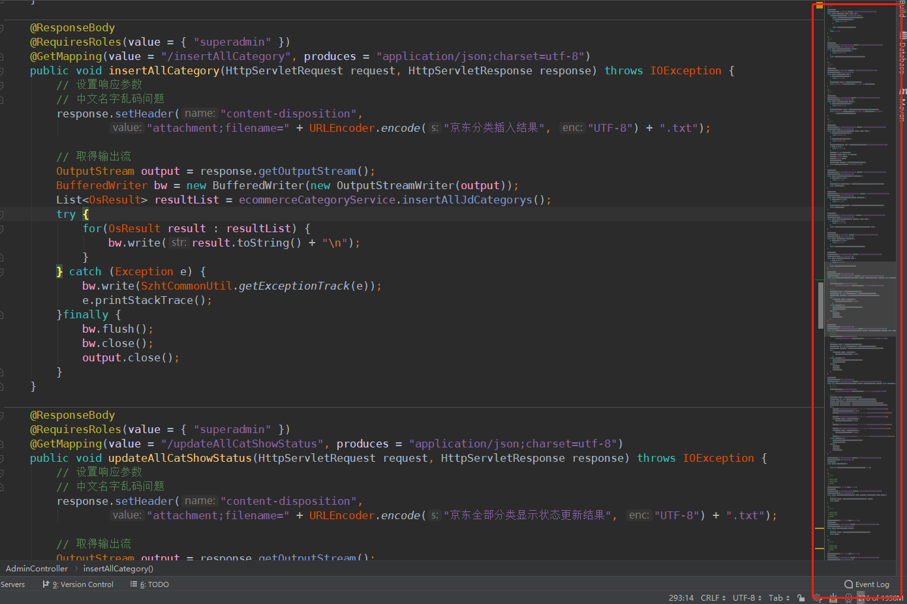

# Idea

## 插件

- CodeGlance2

  


# webstorm 

- ### 颜色设置

  ```js
  F92672
  F8F8F2
  A6E22E
  E6DB74
  AE81FF
  
  
  F92672
  FFC66D
  FD971F
  A6E22E
  E6DB74
  AE81FF
  ```

  

### 插件

- String Manipulation